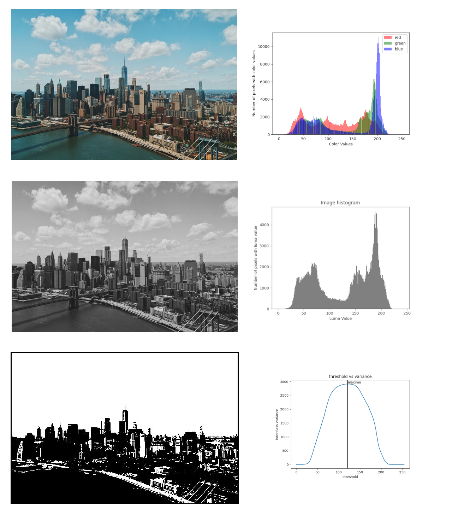
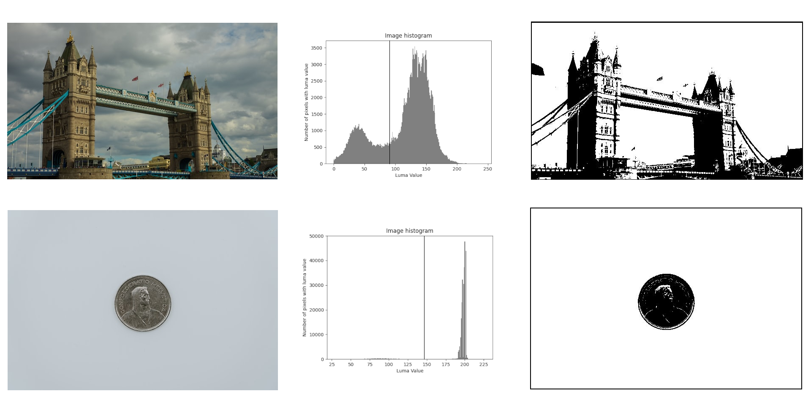

# Otsu's Binarization

Code that implements the otsu's binarization algorithm for binarizing images.

## Implementation

Takes an image, and sets all the pixels with a luma value above a certain threshold to white and all others to black. The threshold is dynamically determined for each image so that it maximizes the interclass variance between the class of pixels using [Otsu's method](https://en.wikipedia.org/wiki/Otsu%27s_method)



Image of [Manhattan Bridge, New York by Patrick Tomasso](https://unsplash.com/photos/SVVTZtTGyaU) taken from [Unsplash](https://unsplash.com)
## Examples

Some more examples of the algorithm in action



images of [London bridge by Kevin Keith](https://unsplash.com/photos/fE3c40Fjl0M) and [Coin by Claudio Shcwarz](https://unsplash.com/photos/gcVwy4-735s) taken from [Unsplash](https://unsplash.com)

## Dependancies

Numpy for manipulating matrices, Pillow for loading and saving images.
*Optional Matplotlib for plotting histograms and other graphs for visualization*
```
pip install matplotlib
pip install numpy
pip install pillow
```
